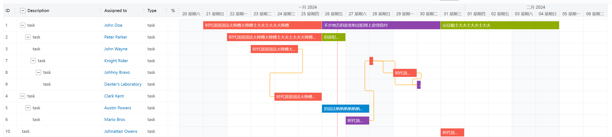
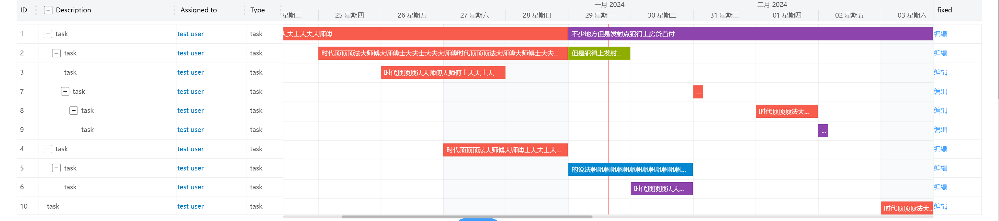

<h1>改自 <a href="https://github.com/neuronetio/gantt-elastic">gantt-elastic</a>项目</h1>
<br>
<h3>增加一行展示多个图形,以及图形自定义展示，以及操作列</h3>

```
// 新增功能配置
chart: {
	text: {
	ellipsis: true, // 字体展示在图形上 超出省略展示
	style: { // 字体颜色配置
		color: '#fff',
		wordBreak: 'break-all'
	}
       }
}


taskList: {
        ...
	columns: [
		{
			id: 99,
			label: 'fixed',
			// value: 'test', // value不生效 有render时
			fixed: 'right', // 列会靠右侧
			width: 90,
			render: (val, row) => {
			// val 为 value的值， row 是整行数据； render函数可以替换 原有的html:true
			return (
				<el-button size="mini" type="text">
					编辑
				</el-button>
				);
		}
	  }
	]
}
```




### Installation

`npm install --save gantt-elastic-custum-chart` or download zip from github / clone repo

and if you want default header

`npm install --save gantt-elastic-header`

```javascript
import Vue from 'vue';
import GanttElastic from "gantt-elastic-custum-chart";
import Header from "gantt-elastic-header"; // if you want standard header (npm i -s gantt-elastic-header)
new Vue({
  el:'#gantt',
  template:`<gantt-elastic :tasks="tasks" :options="options">
    <gantt-elastic-header slot="header"></gantt-elastic-header>
    <gantt-elastic-footer slot="footer"></gantt-elastic-footer>
  </gantt-elastic>`,
  components: {
    ganttElasticHeader: {template:`<span>your header</span>`}, // or Header
    ganttElastic: GanttElastic
    ganttElasticFooter: {template:`<span>your footer</span>`},
  },
  data() {
    return {
      tasks: tasks,
      options: options
    };
  }
});
```

or

```javascript
import Vue from 'vue';
import App from './App.vue'; // your app that uses gantt-elastic from 'gantt-elastic/src/GanttElastic.vue'

new Vue({
  el: '#app',
  render: h => h(App)
});
```

### uglifyjs

If you are using uglifyjs in your project be sure to have es6 compatible version like [uglify-es](https://www.npmjs.com/package/uglify-es)

### Licensce

MIT
